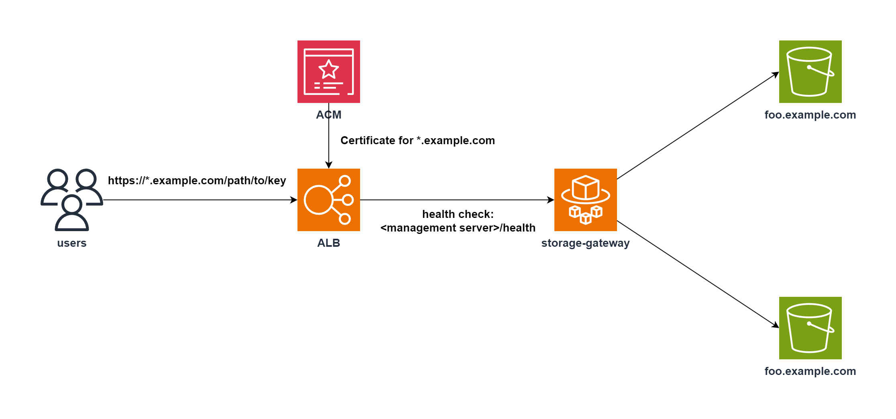

# storage-gateway

Simple gateway server for static contents of S3 buckets.

## Overview



## Required permissions

storage-gateway must allow the following actions for the S3 buckets it accesses.

- s3:ListBucket
- s3:GetObject

## Environment variables

| Variable                       | Description                                                    | Required | Default |
|--------------------------------|----------------------------------------------------------------|----------|---------|
| GW_ALLOW_DOMAINS               | Comma separated list of domains to allow access to the gateway | yes      |         |
| GW_ROOT_OBJECT                 | The object to return when the root path is requested           | no       |         |
| GW_SUBDIR_ROOT_OBJECT          | The object to return when a subdirectory is requested          | no       |         |
| GW_NO_SUCH_KEY_REDIRECT_OBJECT | The object to return when a key is not found                   | no       |         |
| GW_ALLOW_CROSS_ACCOUNT         | Allow cross account access                                     | no       | false   |
| GW_GATEWAY_PORT                | The port to run the gateway on                                 | no       | 8000    |
| GW_MANAGEMENT_PORT             | The port to run the management server on                       | no       | 8080    |

## Access S3 buckets of other AWS accounts

To access S3 buckets of other AWS accounts, you must set the `GW_ALLOW_CROSS_ACCOUNT` environment variable to `true`.  
In this case, it is recommended to restrict which accounts can access with the following IAM policy.

```json
{
  "Version": "2012-10-17",
  "Statement": [
    {
      "Sid": "Statement1",
      "Effect": "Allow",
      "Action": [
        "s3:ListBucket"
      ],
      "Resource": [
        "arn:aws:s3:::*.example.com"
      ]
    },
    {
      "Sid": "Statement2",
      "Effect": "Allow",
      "Action": [
        "s3:GetObject"
      ],
      "Resource": [
        "arn:aws:s3:::*.example.com/*"
      ],
      "Condition": {
        "StringEquals": {
          "s3:ResourceAccount": [
            "012345678901",
            "123456789012"
          ]
        }
      }
    }
  ]
}
```
